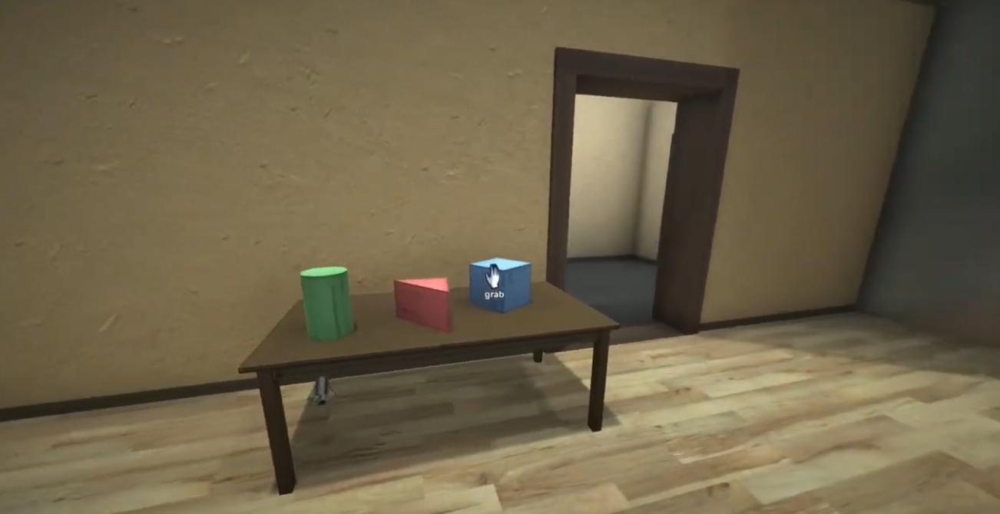
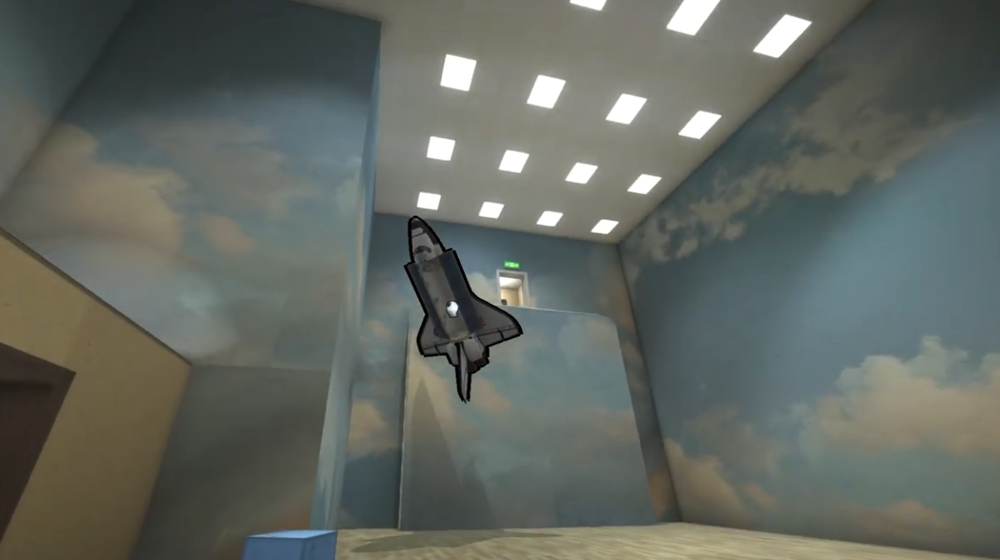
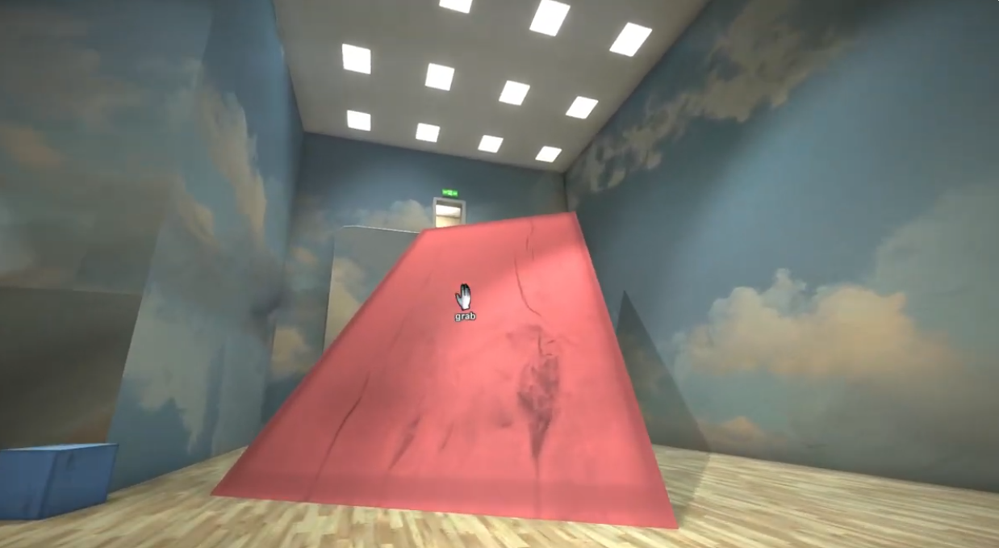

# Especificação da Implementação

> [!CAUTION]
> - Você <ins>**não pode utilizar ferramentas de IA para escrever esta
>   especificação**</ins>

## Integrantes da dupla

- **Aluno 1 - Nome**: <mark>`Anisio Neto Meneneses Lorentz`</mark>
- **Aluno 1 - Cartão UFRGS**: <mark>`00342139`</mark>

- **Aluno 2 - Nome**: <mark>`Antonio de Pádua Santos Júnior`</mark>
- **Aluno 2 - Cartão UFRGS**: <mark>`00318785`</mark>

## Detalhes do que será implementado

- **Título do trabalho**: <mark>`Puzzle 3D de Construção de Caminho em Ambiente Interno`</mark>
- **Parágrafo curto descrevendo o que será implementado**: <mark>`Será implementada uma aplicação gráfica 3D inspirada em uma sala de puzzle em primeira pessoa. O usuário deverá explorar um ambiente interno, interagir com peças geométricas posicionadas em uma mesa ou no chão e organizar blocos, cilindros e rampas para construir um caminho até uma plataforma elevada ou porta de saída. A aplicação terá movimentação em tempo real, colisões simplificadas, objetos texturizados, iluminação e animações baseadas no tempo.`</mark>

## Especificação visual

### Vídeo - Link

> [!IMPORTANT]
> - Coloque aqui um link para um vídeo que mostre a aplicação gráfica
>   de referência que você vai implementar. **Sua implementação deverá
>   ser o mais parecido possível com o que é mostrado no vídeo (mais
>   detalhes abaixo).**
> - **Você não pode escolher como referência: (1) algum trabalho realizado
>   por outros alunos desta disciplina, em semestres anteriores. (2) Minecraft.**
> - Por exemplo, você pode colocar um vídeo de um jogo que você gosta,
>   e seu trabalho final será uma re-implementação do jogo.
> - O vídeo pode ser um link para YouTube, Google Drive, ou arquivo mp4 dentro
>   do próprio repositório. Mas, garanta que qualquer um tenha
>   permissão de acesso ao vídeo através deste link.

<mark>`https://www.youtube.com/watch?v=HEBEQhwG-rU`</mark>

### Vídeo - Timestamp

> [!IMPORTANT]
> - Coloque aqui um **intervalo de ~30 segundos** do vídeo acima, que
>   será a base de comparação para avaliar se o seu trabalho final
>   conseguiu ou não reproduzir a referência.

- **Timestamp inicial**: <mark>`2:35`</mark>
- **Timestamp final**: <mark>`3:05`</mark>

### Imagens

> [!IMPORTANT]
> - Coloque aqui **três imagens** capturadas do vídeo acima, que você
>   irá usar como ilustração para as explicações que vêm abaixo.

<mark>

**Imagem 1 - Mesa inicial com objetos geométricos manipuláveis**

**Imagem 2 - Ambiente interno iluminado com plataforma superior**

**Imagem 3 - Caminho final com rampa até região elevada**

</mark>

## Especificação textual

Para cada um dos requisitos abaixo (detalhados no [Enunciado do Trabalho final - Moodle](https://moodle.ufrgs.br/mod/assign/view.php?id=6018620)), escreva um parágrafo **curto** explicando como este requisito será atendido, apontando itens específicos do vídeo/imagens que você incluiu acima que atendem estes requisitos.

### Malhas poligonais complexas
<mark>`A cena será composta por uma sala 3D, mesa, plataforma elevada, porta, rampa, blocos, cilindros e objetos decorativos. Esses elementos serão representados por malhas poligonais formadas por triângulos. A Imagem 1 mostra a mesa com objetos geométricos manipuláveis, enquanto a Imagem 2 mostra o ambiente interno com plataforma elevada, que servirá como objetivo visual do puzzle.`</mark>

### Transformações geométricas controladas pelo usuário
<mark>`O usuário poderá controlar a movimentação do personagem/câmera e também manipular peças do puzzle. As peças geométricas poderão ser selecionadas, movidas e rotacionadas para formar um caminho até a plataforma elevada. A Imagem 1 será usada como referência para a interação com objetos sobre a mesa, e a Imagem 3 será usada como referência para a rampa posicionada no caminho final.`</mark>

### Diferentes tipos de câmeras
<mark>`A aplicação terá uma câmera livre em primeira pessoa para exploração da sala e uma câmera do tipo look-at focada na mesa ou na região principal do puzzle. A câmera livre será usada durante a movimentação normal do jogador pelo ambiente, enquanto a câmera look-at será usada para facilitar a visualização e manipulação das peças geométricas mostradas na Imagem 1.`</mark>

### Instâncias de objetos
<mark>`Serão utilizadas múltiplas instâncias de objetos repetidos, como blocos, luminárias, peças geométricas e elementos da sala. Essas instâncias compartilharão a mesma malha poligonal, mas terão posições, rotações e escalas diferentes por meio de matrizes de modelo distintas. As peças geométricas da Imagem 1 e os elementos repetidos de iluminação do teto na Imagem 2 servem como referência para esse requisito.`</mark>

### Testes de intersecção
<mark>`Os testes de intersecção serão usados para impedir que o jogador atravesse paredes e objetos principais da cena. Também serão usados para detectar quando o jogador está próximo de uma peça manipulável e pode selecioná-la. Além disso, colisões simples serão utilizadas para validar o posicionamento das peças usadas na construção do caminho, como a rampa mostrada na Imagem 3.`</mark>

### Modelos de Iluminação em todos os objetos
<mark>`Todos os objetos da cena receberão iluminação não trivial. Será utilizado um modelo com componentes ambiente, difusa e especular, permitindo destacar a forma dos objetos e dar aparência tridimensional à sala, às peças geométricas, à mesa, às paredes e à plataforma. A Imagem 2 será usada como referência visual para o ambiente interno iluminado.`</mark>

### Mapeamento de texturas em todos os objetos
<mark>`Todos os objetos virtuais terão cores definidas por texturas. Serão usadas pelo menos três imagens distintas, como textura de madeira para piso e mesa, textura de parede para o ambiente, textura colorida para as peças do puzzle e textura específica para rampa, porta ou objetos decorativos. As texturas de piso, parede e objetos visíveis nas Imagens 1, 2 e 3 serão usadas como referência visual.`</mark>

### Movimentação com curva Bézier cúbica
<mark>`Um objeto decorativo ou indicador de objetivo, como uma pequena esfera, chave ou nave, terá sua movimentação definida por uma curva Bézier cúbica. Esse objeto se moverá suavemente em um caminho curvo dentro da sala, servindo como elemento visual e ajudando a indicar a direção da plataforma elevada mostrada na Imagem 2.`</mark>

### Animações baseadas no tempo ($\Delta t$)
<mark>`As movimentações da câmera, do jogador, das peças manipuladas e do objeto animado pela curva Bézier serão calculadas com base no tempo decorrido entre quadros. Dessa forma, a aplicação manterá velocidades consistentes mesmo em computadores com diferentes taxas de quadros.`</mark>

## Limitações esperadas

> [!IMPORTANT]
> - Coloque aqui uma lista de detalhes visuais ou de interação que
>   aparecem no vídeo e/ou imagens acima, mas que você **não pretende
>   implementar** ou que você **irá implementar parcialmente**.
> - Para cada item, **explique por que** não será implementado ou por
>   que será implementado parcialmente.

<mark>

- `A aplicação não implementará física realista completa. As peças serão manipuladas diretamente pelo usuário, com movimentação e rotação controladas por teclado e/ou mouse.`
- `As colisões serão simplificadas, utilizando caixas ou esferas de colisão, pois o objetivo principal é validar interações básicas e impedir atravessamento de objetos.`
- `A aplicação será inspirada no vídeo de referência, mas não será uma cópia exata da cena original. O foco será reproduzir a ideia de sala de puzzle com objetos geométricos, mesa, rampa e objetivo em uma região elevada.`
- `Sombras realistas, partículas, efeitos sonoros e física avançada não serão prioridade, pois o trabalho focará nos requisitos principais de computação gráfica.`
- `A movimentação das peças será simplificada para evitar comportamento instável. O usuário poderá pegar, mover, rotacionar e soltar objetos, mas sem simulação realista de peso ou impacto.`
- `A plataforma elevada e o caminho até ela serão simplificados para manter o escopo viável dentro do tempo disponível para desenvolvimento.`

</mark>